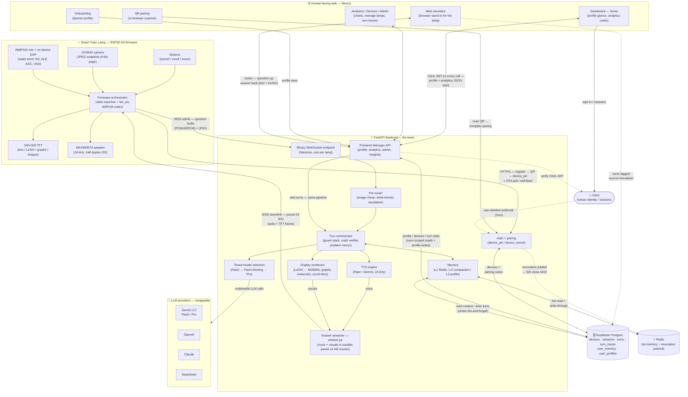
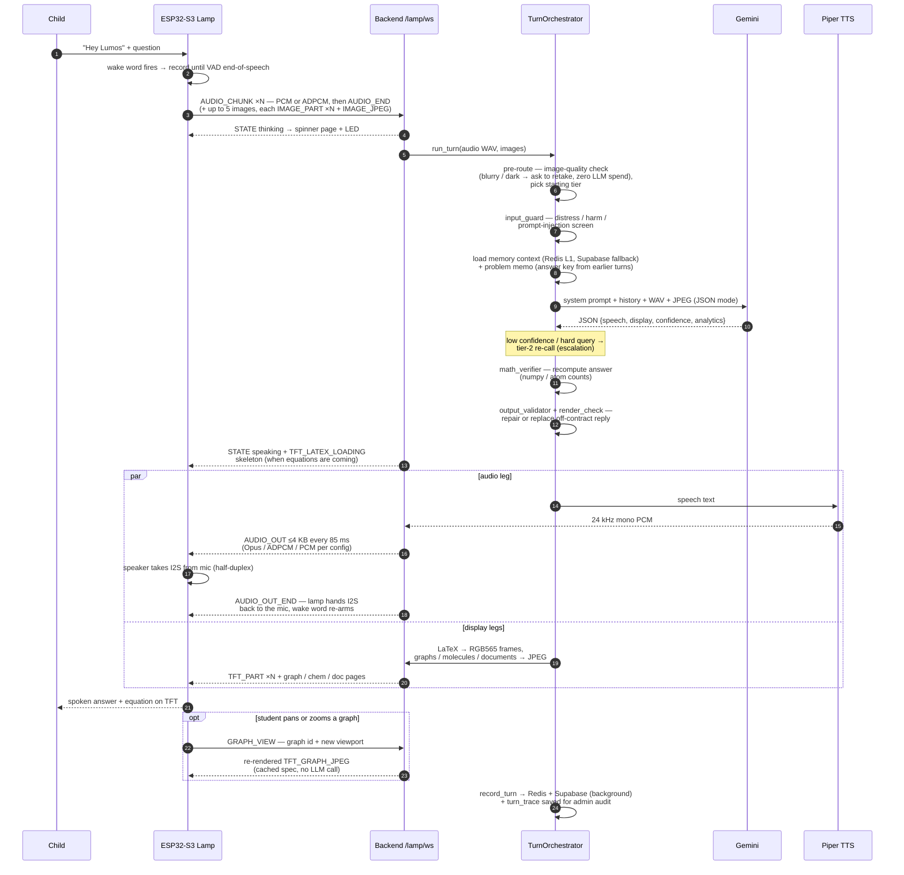
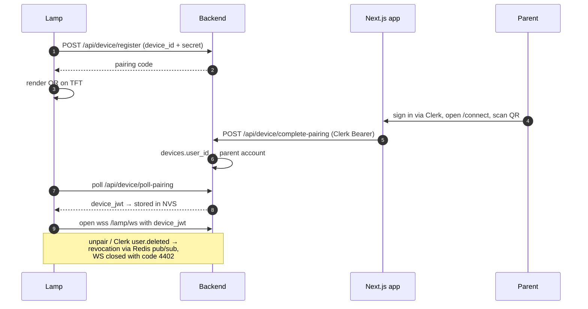

# Architecture Diagram — Lumos Smart Tutor Lamp

System-level architecture across the three repos in this workspace:

| Tier | Repo / path | Stack |
| --- | --- | --- |
| Device firmware | `Smart-Tutor-Lamp/tutor_lamp/` | ESP32-S3, Arduino, FreeRTOS |
| Cloud backend | `Smart-Tutor-Lamp-backend/app/` | Python, FastAPI, asyncio |
| Web app | `Smart-Tutor-frontend/` | Next.js, Clerk |

---

## 1. System overview

**Key rule shown above:** the lamp never talks to Clerk — it only sees the backend's
HTTPS + WSS endpoints and authenticates with the backend-minted `device_jwt`. All
human identity lives in Clerk and is verified server-side.

---

## 2. Tutoring turn — end-to-end data flow

---

## 3. Pairing flow — QR onboarding

---

## 4. Contracts worth remembering

- **Wire protocol:** type-byte-framed binary WebSocket protocol; every message
  ≤ ~4 KB in both directions — large payloads (JPEG up, TFT frames down) are
  app-layer chunked. **Uplink frames:** audio chunks (PCM or ADPCM 4:1),
  AUDIO_END, image chunks, CANCEL, AUDIO_RESET, GRAPH_VIEW (pan/zoom), PING.
  **Downlink frames:** STATE byte (idle / listening / thinking / speaking /
  error / unpaired → drives LED + pages), TTS audio + AUDIO_OUT_END, LaTeX /
  text / graph / chem / scroll-doc frames, TFT_LATEX_LOADING skeleton, PONG.
- **Audio out:** 24 kHz mono, ≤4 KB chunks paced at 85 ms — wire codec is Opus
  by default (ADPCM / raw PCM fallbacks); `AUDIO_OUT_END` is mandatory, it
  releases the half-duplex I2S bus back to the mic so the wake word re-arms.
- **Memory:** L1 verbatim recent turns (Redis→Supabase), L2 session-summary
  compaction, L3 cross-session user profile — shared by the lamp and the web simulator.
- **Ingest gates:** up to 5 images per turn, each capped at 256 KB (an over-cap
  or excess image is dropped but the turn still runs); audio 0.5 s min / 30 s
  max (truncated over cap); a new AUDIO_END cancels and awaits any in-flight turn.
- **Interactive graphs:** graph specs are cached per session — a lamp GRAPH_VIEW
  pan/zoom re-renders server-side with zero LLM spend (re-render calls coalesced).
- **Auth split:** Clerk owns humans (frontend), backend owns devices (`device_jwt`);
  the ESP32 never sees Clerk.
- **Safety + quality gates are code, not prompt rules:** `input_guard` screens
  incoming text (distress / harm / injection), `math_verifier` recomputes the
  model's arithmetic, `output_validator` + `render_check` repair or replace any
  off-contract reply before dispatch.
- **Observability:** `turn_trace` passively records every pipeline phase to
  `turn_traces` (with media in the `/blobs` static mount) for the admin
  visual-pipeline audit; it can never fail or slow a live turn.
- **Offline enrichment:** topic tagging, mistake-type tagging, transcription,
  embedding, and analytics rollups run as background workers — never on the
  live turn path.
- **OTA:** the lamp polls `GET /lamp/ota/version` at boot and self-flashes when
  the backend advertises a newer firmware.
