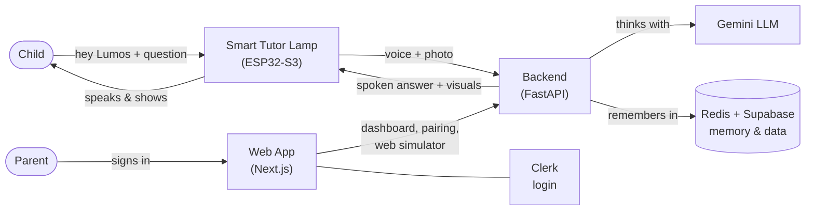
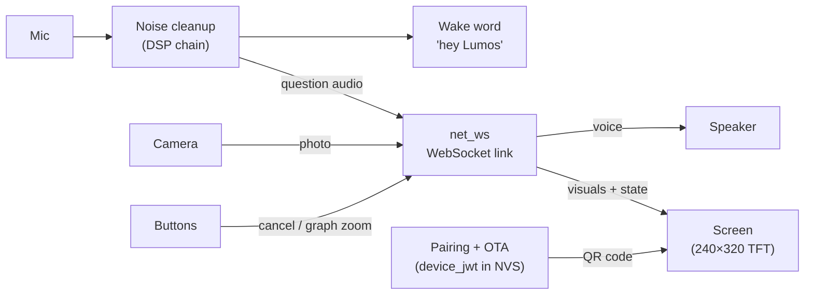
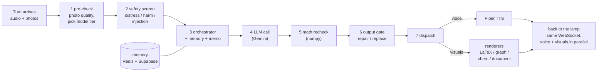
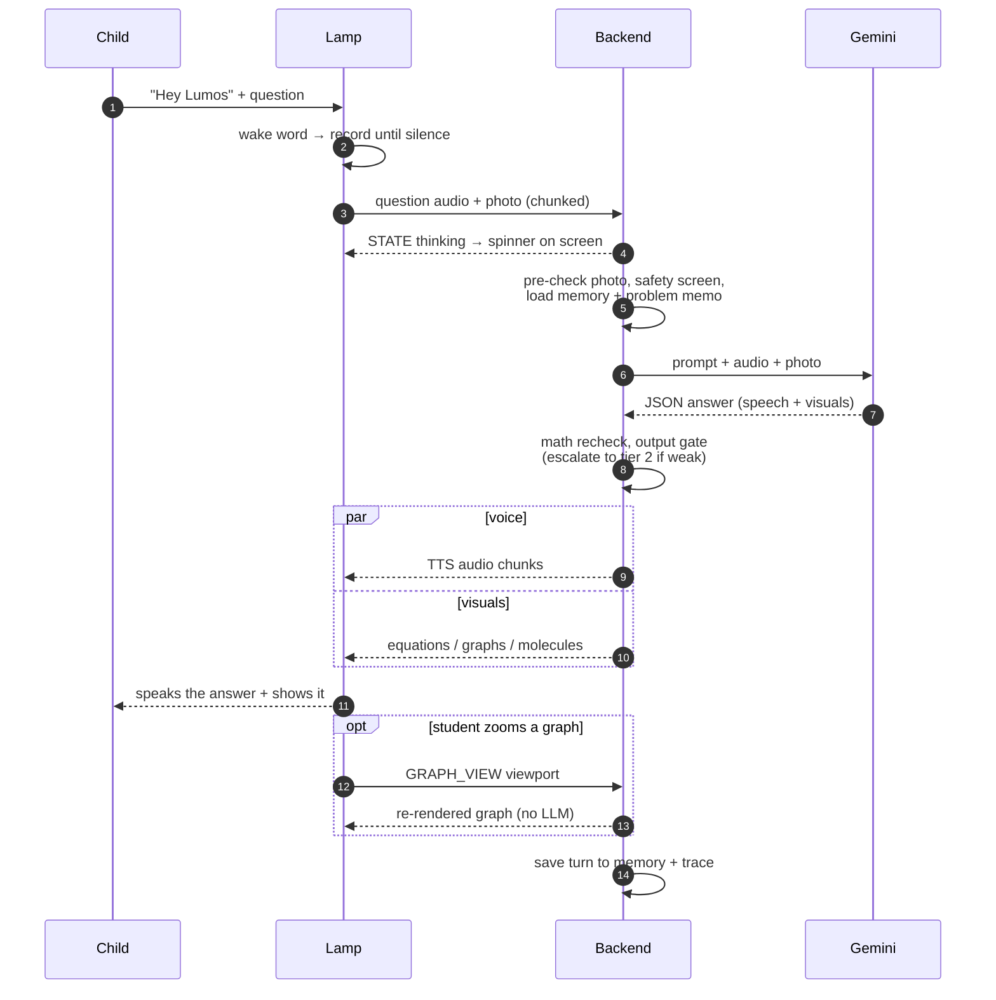
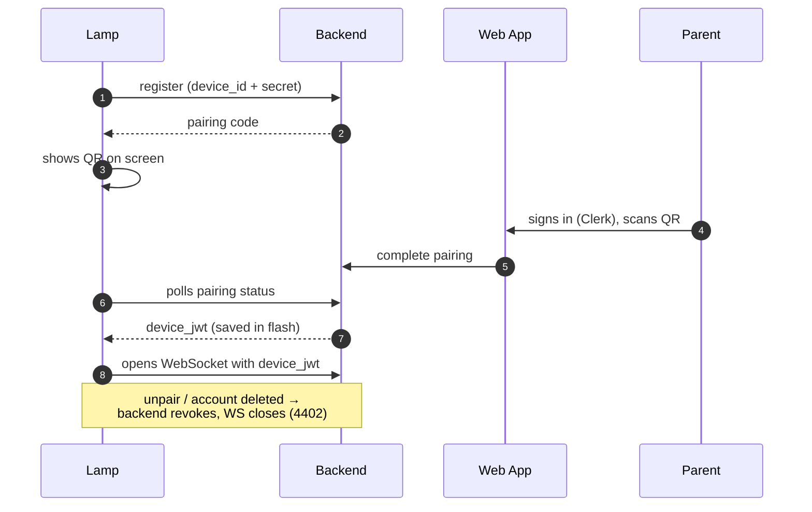

# Architecture Diagram — Lumos Smart Tutor Lamp

| Tier | Repo / path | Stack |
|---|---|---|
| Device firmware | `Smart-Tutor-Lamp/tutor_lamp/` | ESP32-S3, Arduino, FreeRTOS |
| Cloud backend | `Smart-Tutor-Lamp-backend/app/` | Python, FastAPI, asyncio |
| Web app | `Smart-Tutor-frontend/` | Next.js, Clerk |

---

## 1. Big picture

- The **lamp never talks to Clerk** — it authenticates to the backend with its own
  `device_jwt`. Clerk only handles humans on the web app.
- The web app's **simulator** page uses the exact same backend brain as the lamp.

---

## 2. Inside the lamp (firmware)

Details that matter (in code, not on the arrows):

- **DSP chain** = noise suppression → adaptive filter → gain control → voice
  detection (`NS → ALE → AGC → VAD`); wake word runs on-device (Edge Impulse).
- **One WebSocket** carries everything, every message ≤ 4 KB; big payloads
  (photos up, screen frames down) are cut into chunks. Mic audio can be
  ADPCM-compressed; up to 5 photos per turn.
- **Speaker and mic share one I2S bus** (half-duplex): while the lamp speaks the
  mic is off; `AUDIO_OUT_END` hands the bus back and the wake word re-arms.
- **Buttons**: cancel a turn, scroll answer pages, pan/zoom graphs (`GRAPH_VIEW`
  asks the backend to re-render — no LLM call).
- **Pairing + OTA** run over HTTPS: register → QR on screen → poll for
  `device_jwt`; at boot the lamp polls `/lamp/ota/version` and self-flashes
  newer firmware.

---

## 3. Inside the backend (one tutoring turn)

Code map: `routes/ws_lamp.py` receives frames → `session.py` buffers the turn →
`services/orchestrator.py` runs steps 1–7 (`escalation_router`, `input_guard`,
`problem_memo`, `session_memory`, `llm_*`, `math_verifier`,
`output_validator`, `dispatch`) → providers render (`tts_piper`,
`latex_renderer`, `graph_renderer`, `rdkit_renderer`, `document`).

Also in the backend (off the live path):

- **Memory** — L1 recent turns (Redis, Supabase fallback), L2 session summary,
  L3 cross-session learner profile (`session_memory.py`).
- **Escalation** — low confidence / hard question triggers a tier-2 re-call.
- **turn_trace** — passively records every step of every turn for the admin
  "pipeline audit" view; can never slow a turn.
- **Offline workers** — topic tagging, mistake tagging, transcription,
  embeddings, analytics rollups.
- **HTTP routes** — device pairing, OTA, frontend/dashboard APIs, admin, pilot,
  insights, Clerk webhook (user deleted → device unlinked via Redis pub/sub).

---

## 4. One tutoring turn, step by step

---

## 5. Pairing a new lamp

---

## 6. Contracts worth remembering

- **Wire protocol:** type-byte-framed binary WebSocket protocol; every message
  ≤ ~4 KB in both directions — large payloads (JPEG up, TFT frames down) are
  app-layer chunked. **Uplink frames:** audio chunks (PCM or ADPCM 4:1),
  AUDIO_END, image chunks, CANCEL, AUDIO_RESET, GRAPH_VIEW (pan/zoom), PING.
  **Downlink frames:** STATE byte (idle / listening / thinking / speaking /
  error / unpaired → drives LED + pages), TTS audio + AUDIO_OUT_END, LaTeX /
  text / graph / chem / scroll-doc frames, TFT_LATEX_LOADING skeleton, PONG.
- **Audio out:** 24 kHz mono, ≤4 KB chunks paced at 85 ms — wire codec is Opus
  by default (ADPCM / raw PCM fallbacks); `AUDIO_OUT_END` is mandatory, it
  releases the half-duplex I2S bus back to the mic so the wake word re-arms.
- **Voice + visuals stream concurrently** (`asyncio.gather`) so speech is never
  blocked behind a multi-MB equation payload.
- **Memory:** L1 verbatim recent turns (Redis→Supabase), L2 session-summary
  compaction, L3 cross-session user profile — shared by the lamp and the web simulator.
- **Ingest gates:** up to 5 images per turn, each capped at 256 KB (an over-cap
  or excess image is dropped but the turn still runs); audio 0.5 s min / 30 s
  max (truncated over cap); a new AUDIO_END cancels and awaits any in-flight turn.
- **Safety + quality gates are code, not prompt rules:** `input_guard` screens
  incoming text, `math_verifier` recomputes arithmetic, `output_validator` +
  `render_check` repair or replace any off-contract reply before dispatch.
- **Auth split:** Clerk owns humans (frontend), backend owns devices
  (`device_jwt`); the ESP32 never sees Clerk.
